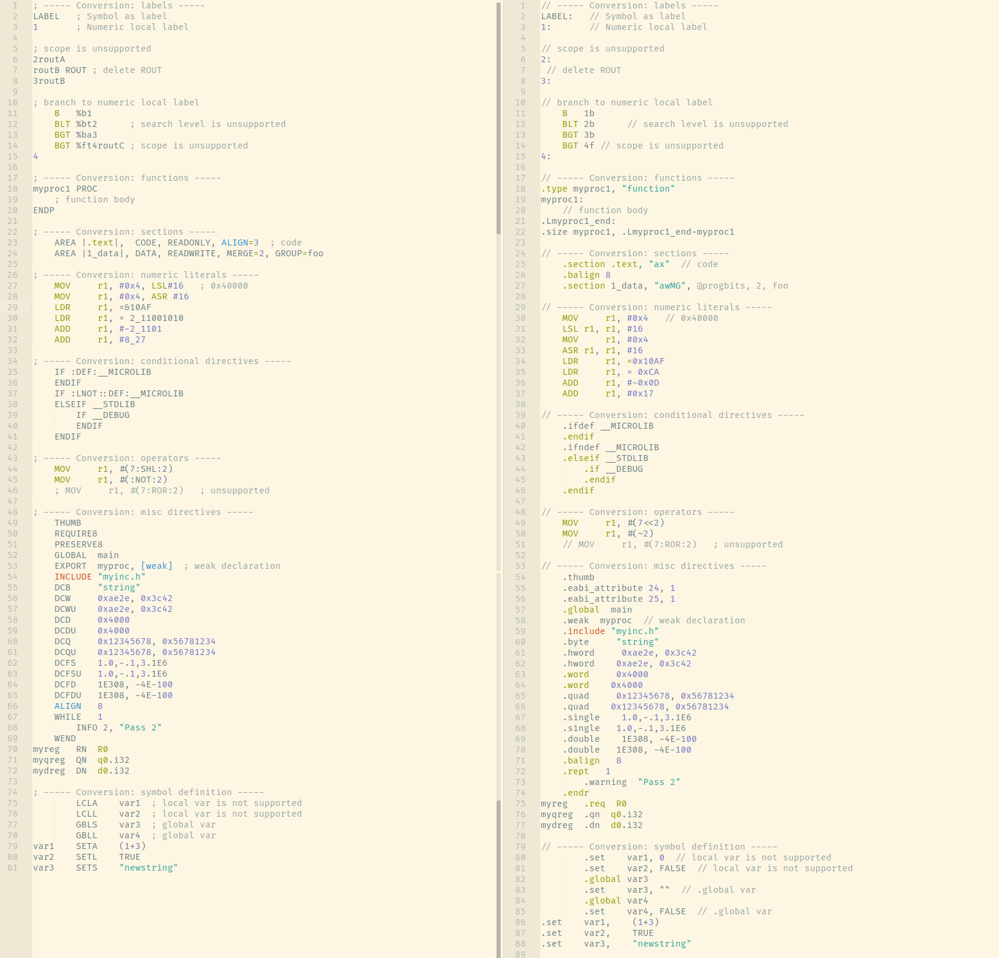

# arm2gas

<div align="center">
<p>
      <a href="https://github.com/typowritter/arm2gas"></a>
      <a href="https://github.com/typowritter/arm2gas/blob/main/LICENSE"></a>
</p>
</div>
Migrate legacy ARM syntax assembly to GNU syntax (GAS)

## Usage

`arm2gas.pl [options] file1 [file2...]`

### Options

| Switch                  | Descriptions                                            |
| :---------------------- | :------------------------------------------------------ |
| `-c, --compatible`      | Keeps compatibility with armclang assembler             |
| `-h, --help`            | Show this help text                                     |
| `-i, --verbose`         | Show a message on every suspicious convertions          |
| `-n, --no-comment`      | Discard all the comments in output                      |
| `-o, --output=<file>`   | Specify the output filename                             |
| `-r, --return-code`     | Print return code definitions                           |
| `-s, --strict`          | Error on directives that have no equivalent counterpart |
| `-v, --version`         | Show version info                                       |
| `-w, --no-warning`      | Suppress all warning messages                           |
| `-x, --suffix=<string>` | Suffix of the output filename [default: '.out']         |

## Supported conversions

- [X] [Comments](https://developer.arm.com/documentation/dui0742/g/Migrating-ARM-syntax-assembly-code-to-GNU-syntax/Comments?lang=en)
- [X] [Labels\*](https://developer.arm.com/documentation/dui0742/g/Migrating-ARM-syntax-assembly-code-to-GNU-syntax/Labels?lang=en)
- [X] [Numeric local labels](https://developer.arm.com/documentation/dui0742/g/Migrating-ARM-syntax-assembly-code-to-GNU-syntax/Numeric-local-labels?lang=en)
- [X] [Functions](https://developer.arm.com/documentation/dui0742/g/Migrating-ARM-syntax-assembly-code-to-GNU-syntax/Functions?lang=en)
- [X] [Sections](https://developer.arm.com/documentation/dui0742/g/Migrating-ARM-syntax-assembly-code-to-GNU-syntax/Sections?lang=en)
- [X] [Symbols with special characters](https://developer.arm.com/documentation/dui0742/g/Migrating-ARM-syntax-assembly-code-to-GNU-syntax/Symbol-naming-rules?lang=en)
- [X] [Numeric literals](https://developer.arm.com/documentation/dui0742/g/Migrating-ARM-syntax-assembly-code-to-GNU-syntax/Numeric-literals?lang=en)
- [X] [Operators](https://developer.arm.com/documentation/dui0742/g/Migrating-ARM-syntax-assembly-code-to-GNU-syntax/Operators?lang=en)
- [X] [Aligment](https://developer.arm.com/documentation/dui0742/g/Migrating-ARM-syntax-assembly-code-to-GNU-syntax/Alignment?lang=en)
- [X] [PC-relative addressing](https://developer.arm.com/documentation/dui0742/g/Migrating-ARM-syntax-assembly-code-to-GNU-syntax/PC-relative-addressing?lang=en)
- [X] [Directives: Conditional](https://developer.arm.com/documentation/dui0742/g/Migrating-ARM-syntax-assembly-code-to-GNU-syntax/Conditional-directives?lang=en)
- [X] [Directives: Data definition](https://developer.arm.com/documentation/dui0742/g/Migrating-ARM-syntax-assembly-code-to-GNU-syntax/Data-definition-directives?lang=en)
- [X] [Directives: Instruction set](https://developer.arm.com/documentation/dui0742/g/Migrating-ARM-syntax-assembly-code-to-GNU-syntax/Instruction-set-directives?lang=en)
- [X] [Directives: Symbol definition](https://developer.arm.com/documentation/dui0742/g/Migrating-ARM-syntax-assembly-code-to-GNU-syntax/Symbol-definition-directives?lang=en)
- [X] [Directives: Miscellaneous](https://developer.arm.com/documentation/dui0742/g/Migrating-ARM-syntax-assembly-code-to-GNU-syntax/Miscellaneous-directives?lang=en)

[\*] *inline label is not supported yet.*

## Demo

Conversion result of `demo.s` (with option `-i -c`)



Command-line output:

```bash
$ ./arm2gas.pl -i -c test.s
WARN: test.s:6 -> test.s.out:6: Numeric local label with scope '2routA' is not supported in GAS, converting to '2'
WARN: test.s:7 -> test.s.out:7: Scope of numeric local label is not supported in GAS, removing ROUT directives
WARN: test.s:8 -> test.s.out:8: Numeric local label with scope '3routB' is not supported in GAS, converting to '3'
WARN: test.s:12 -> test.s.out:12: Can't specify label's search level 't' in GAS, dropping
WARN: test.s:13 -> test.s.out:13: Can't specify label's search level 'a' in GAS, dropping
WARN: test.s:14 -> test.s.out:14: Can't specify label's search level 't' in GAS, dropping
WARN: test.s:14 -> test.s.out:14: Can't specify label's scope 'routC' in GAS, dropping
WARN: test.s:23 -> test.s.out:25: Not all AREA attributes are supported, need a manual check
WARN: test.s:24 -> test.s.out:27: Not all AREA attributes are supported, need a manual check
WARN: test.s:27 -> test.s.out:30: Implicit shift is not supported in GAS, converting to explicit shift
WARN: test.s:28 -> test.s.out:32: Implicit shift is not supported in GAS, converting to explicit shift
INFO: test.s:29 -> test.s.out:34: Converting hexidecimal '&10AF' to '0x10AF'
INFO: test.s:30 -> test.s.out:35: Converting '2_11001010' to hexidecimal literal '0xCA'
INFO: test.s:31 -> test.s.out:36: Converting '-2_1101' to hexidecimal literal '-0x0D'
INFO: test.s:32 -> test.s.out:37: Converting '8_27' to hexidecimal literal '0x17'
WARN: test.s:46 -> test.s.out:51: Unsupported operator :ROR:, need a manual check
WARN: test.s:54 -> test.s.out:59: Conversion containing strings needs a manual check
WARN: test.s:55 -> test.s.out:60: Conversion containing strings needs a manual check
WARN: test.s:68 -> test.s.out:73: Conversion containing strings needs a manual check
WARN: test.s:75 -> test.s.out:80: Local variable 'var1' is not supported, using static declaration
WARN: test.s:76 -> test.s.out:81: Local variable 'var2' is not supported, using static declaration
WARN: test.s:81 -> test.s.out:88: Conversion containing strings needs a manual check
```


## Cautions

By default (without `--strict`), for those directives that have no equivalentin GNU format, `arm2gas` will try best to convert and generate warning information on the specific line. Therefore, a 'warning' does **NOT** necessarily mean no issue, please check the conversion result to ensure it works as expected.

Note that `arm2gas` will *assume that the input file is in the **correct** syntax*, otherwise, the conversion result is **UNEXPECTED**

## TODO

- [ ] Macro
- [ ] Inline label